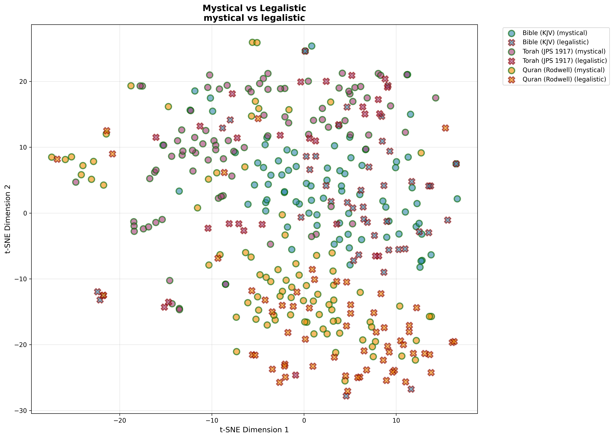
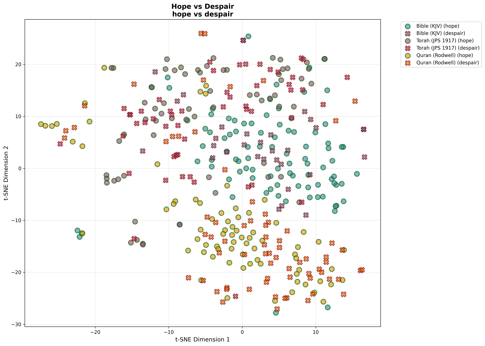
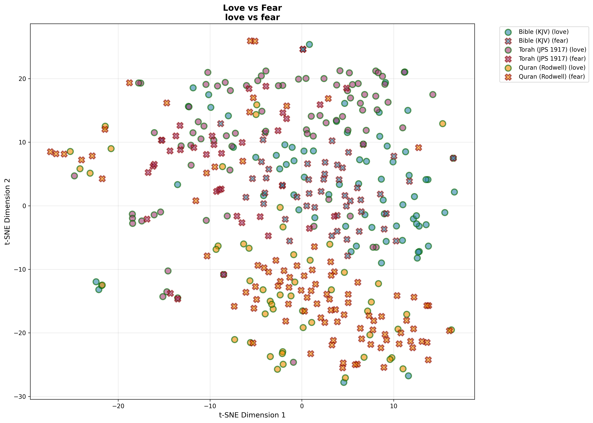
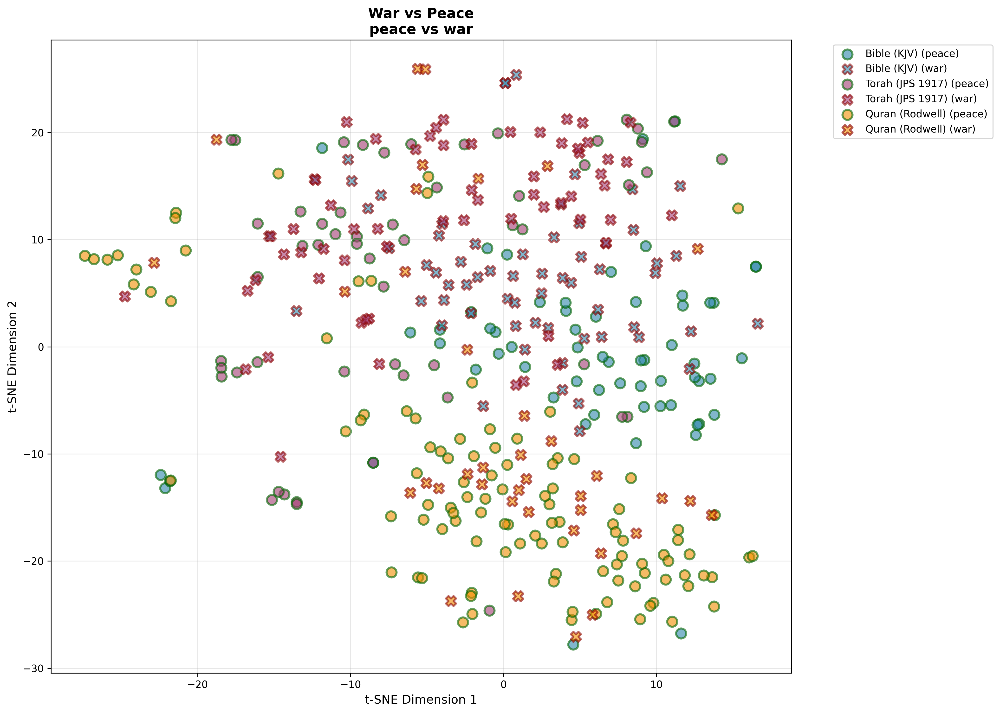
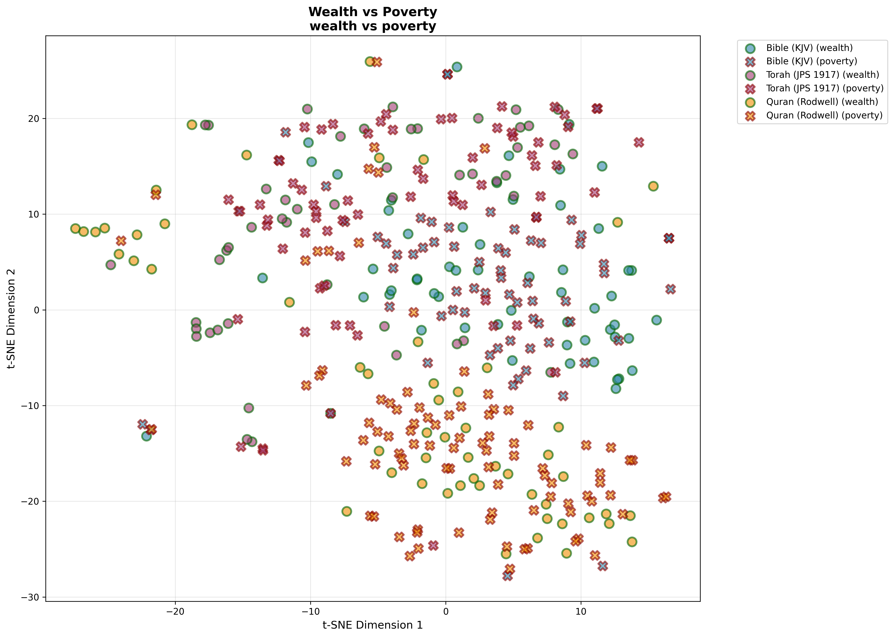

# Extended Semantic Analyses of Religious Texts

This document presents findings from **8 additional semantic analyses** beyond the original good/evil and liberal concepts comparisons.

---

## Table of Contents

1. [Conservative Concepts](#1-conservative-concepts)
2. [Mystical vs Legalistic](#2-mystical-vs-legalistic)
3. [Hope vs Despair](#3-hope-vs-despair)
4. [Love vs Fear](#4-love-vs-fear)
5. [Feminine Concepts](#5-feminine-concepts)
6. [War vs Peace](#6-war-vs-peace)
7. [Nature & Environment](#7-nature--environment)
8. [Wealth vs Poverty](#8-wealth-vs-poverty)
9. [Cross-Analysis Comparison](#cross-analysis-comparison)
10. [Key Insights](#key-insights)

---

## 1. Conservative Concepts


### Overview
Measures alignment with traditional conservative values: tradition, authority, hierarchy, order, duty, obedience, family values, divine law.

### Results

| Text | Mean Similarity | Interpretation |
|------|----------------|----------------|
| **Quran** | **0.2332** | Highest conservative alignment |
| **Torah** | **0.2129** | Moderate-high conservative alignment |
| **Bible** | **0.2041** | Moderate conservative alignment |

### Key Findings:
- **Quran ranks highest** in conservative concepts (tradition, authority, hierarchy)
- All three texts show substantial conservative language
- Relatively small variance (0.029) suggests this dimension is present across all traditions
- Higher than liberal overlap scores, suggesting ancient religious texts naturally emphasize tradition/authority

---

## 2. Mystical vs Legalistic



### Overview
Comparison between mystical experience (transcendence, divine union, spiritual ecstasy) and legalistic approaches (law, commandments, ritual requirements).

### Results

| Text | % Mystical | % Legalistic | Dominant Mode |
|------|-----------|--------------|---------------|
| **Torah** | **75.9%** | 24.1% | Strongly Mystical |
| **Bible** | **66.4%** | 33.6% | Mystical-leaning |
| **Quran** | **58.2%** | 41.8% | Mystical-leaning |

**Mean Scores:**

| Text | Mystical Mean | Legalistic Mean |
|------|--------------|-----------------|
| Quran | 0.2254 | 0.2266 |
| Torah | 0.2198 | 0.1792 |
| Bible | 0.2147 | 0.1897 |

### Key Findings:
- **Torah is most mystical** (75.9%), surprising given common perception of Judaism as legalistic
- **Quran is most balanced** (58/42 split) between mystical and legalistic
- **Bible leans mystical** but has substantial legalistic content
- This reflects the complex nature of religious texts containing both modes

---

## 3. Hope vs Despair



### Overview
Emotional valence analysis comparing themes of hope, salvation, redemption vs doom, judgment, suffering.

### Results

| Text | % Hope | % Despair | Dominant Tone |
|------|--------|-----------|---------------|
| **Bible** | **73.6%** | 26.4% | Strongly Hopeful |
| **Torah** | **56.0%** | 44.0% | Hope-leaning |
| **Quran** | **51.4%** | 48.6% | Nearly Balanced |

### Key Findings:
- **Bible is most hopeful** (73.6%), reflecting themes of resurrection and eternal life
- **Torah is moderately hopeful** (56%), balancing covenant promises with warnings
- **Quran is nearly balanced** (51.4% hope), reflecting both paradise and hell themes
- All texts lean toward hope over despair, suggesting religious optimism

---

## 4. Love vs Fear



### Overview
Emotional framework analysis comparing divine love, compassion, mercy vs fear of God, terror, judgment.

### Results

| Text | % Love | % Fear | Dominant Emotion |
|------|--------|--------|------------------|
| **Torah** | **70.7%** | 29.3% | Love-dominant |
| **Bible** | **58.4%** | 41.6% | Love-leaning |
| **Quran** | **35.6%** | 64.4% | Fear-dominant |

### Key Findings:
- **Torah emphasizes love most** (70.7%): steadfast love (hesed), compassion
- **Bible balances love and fear** (58/42): "God is love" vs "fear of the Lord"
- **Quran emphasizes fear more** (64.4%): fear of God, judgment, and reverence
- Represents fundamental differences in theological emotional emphasis

---

## 5. Feminine Concepts


### Overview
Presence of feminine themes: women, mothers, feminine wisdom, women's voices and experiences.

### Results

| Text | Mean Similarity | Feminine Presence |
|------|----------------|-------------------|
| **Torah** | **0.1500** | Highest |
| **Quran** | **0.1128** | Moderate |
| **Bible** | **0.1036** | Lowest |

### Key Findings:
- **Torah has highest feminine presence** (0.1500): matriarchs (Sarah, Rebecca, Rachel), prominent women
- **Bible (KJV) has lowest** (0.1036): masculine-focused narratives dominate
- **Quran is moderate** (0.1128): mentions women, motherhood, Mary
- All scores are relatively low, reflecting male-centered ancient texts

---

## 6. War vs Peace



### Overview
Analysis of conflict vs harmony themes: warfare, battles, violence vs peace, reconciliation, harmony.

### Results

| Text | % Peace | % War | Dominant Theme |
|------|---------|-------|----------------|
| **Quran** | **74.0%** | 26.0% | Peace-dominant |
| **Torah** | **47.4%** | 52.6% | War-leaning |
| **Bible** | **49.6%** | 50.4% | Perfectly Balanced |

### Key Findings:
- **Quran emphasizes peace most** (74%): "salaam" (peace), peaceful resolution
- **Torah leans toward war** (52.6%): conquest narratives, military campaigns
- **Bible is perfectly balanced** (50/50): "Prince of Peace" vs apocalyptic battles
- Surprising result given common stereotypes about Islam and violence

---

## 7. Nature & Environment


### Overview
Environmental themes: creation, natural world, animals, plants, stewardship of earth.

### Results

| Text | Mean Similarity | Nature Emphasis |
|------|----------------|-----------------|
| **Torah** | **0.1447** | Highest |
| **Quran** | **0.0844** | Moderate |
| **Bible** | **0.0888** | Moderate-Low |

### Key Findings:
- **Torah has strongest nature emphasis** (0.1447): Garden of Eden, agricultural laws, land
- **Bible and Quran are moderate** (~0.085): creation accounts, natural metaphors
- Torah's agrarian focus reflects connection to Land of Israel
- All texts show relatively moderate nature emphasis compared to human-divine relationships

---

## 8. Wealth vs Poverty



### Overview
Economic themes: wealth, prosperity, riches vs poverty, need, social justice for the poor.

### Results

| Text | % Wealth | % Poverty | Focus |
|------|----------|-----------|-------|
| **Quran** | 37.7% | **62.3%** | Poverty/charity-focused |
| **Torah** | 42.2% | **57.8%** | Poverty-focused |
| **Bible** | 45.6% | **54.4%** | Poverty-focused |

**Mean Scores:**

| Text | Wealth Mean | Poverty Mean |
|------|------------|--------------|
| Torah | 0.1131 | 0.1174 |
| Quran | 0.0814 | 0.0937 |
| Bible | 0.0701 | 0.0786 |

### Key Findings:
- **All texts emphasize poverty over wealth** (54-62% poverty-focused)
- **Quran most poverty-focused** (62.3%): zakat, charity, care for poor
- **Torah has highest absolute engagement** with economic themes (0.1174 poverty score)
- Reflects religious concern for social justice and the vulnerable

---

## Cross-Analysis Comparison

### Ranking Summary

**Conservative Concepts** (Highest to Lowest):
1. 🥇 Quran (0.2332)
2. 🥈 Torah (0.2129)
3. 🥉 Bible (0.2041)

**Mystical Orientation** (% Mystical):
1. 🥇 Torah (75.9%)
2. 🥈 Bible (66.4%)
3. 🥉 Quran (58.2%)

**Hope Orientation** (% Hope):
1. 🥇 Bible (73.6%)
2. 🥈 Torah (56.0%)
3. 🥉 Quran (51.4%)

**Love Orientation** (% Love):
1. 🥇 Torah (70.7%)
2. 🥈 Bible (58.4%)
3. 🥉 Quran (35.6%)

**Feminine Presence**:
1. 🥇 Torah (0.1500)
2. 🥈 Quran (0.1128)
3. 🥉 Bible (0.1036)

**Peace Orientation** (% Peace):
1. 🥇 Quran (74.0%)
2. 🥈 Bible (49.6%)
3. 🥉 Torah (47.4%)

**Nature Emphasis**:
1. 🥇 Torah (0.1447)
2. 🥈 Bible (0.0888)
3. 🥉 Quran (0.0844)

**Poverty Focus** (% Poverty):
1. 🥇 Quran (62.3%)
2. 🥈 Torah (57.8%)
3. 🥉 Bible (54.4%)

---

## Key Insights

### 1. **The Quran Paradoxes**

**Conservative yet Peace-focused:**
- Highest conservative values (0.2332) BUT highest peace emphasis (74%)
- Suggests conservatism ≠ militarism
- Peace (salaam) is central despite traditional authority emphasis

**Fear-based yet Poverty-focused:**
- Highest fear emphasis (64.4%) BUT most poverty-focused (62.3%)
- Fear of God motivates social justice (zakat, charity)
- Theological fear drives ethical action

### 2. **Torah's Multifaceted Character**

**Most Mystical yet Most Legalistic (in raw scores):**
- 75.9% mystical chunks BUT highest legalistic raw score (0.1792)
- Contains both modes extensively
- Jewish tradition as both legal and mystical

**Love-dominant yet War-present:**
- 70.7% love BUT 52.6% war themes
- Reflects covenant love alongside conquest narratives
- Historical context of nation-building

**Highest Feminine and Nature presence:**
- Most engagement with women's stories and natural world
- Torah's narrative richness and agricultural context

### 3. **Bible's Balance**

**Consistently Middle-Ground:**
- Balanced on war/peace (50/50)
- Moderate on hope/despair, love/fear
- Reflects diverse authorship and genres

**Hope-dominant:**
- Strongest hope emphasis (73.6%)
- Resurrection, eternal life themes
- Christian eschatological optimism

### 4. **Universal Patterns**

**All Texts:**
- Emphasize poverty over wealth (54-62%)
- Lean toward hope over despair (51-74%)
- Show substantial conservative values (0.20-0.23)
- Have relatively low feminine presence (0.10-0.15)

**Differences Matter:**
- Emotional frameworks differ significantly (love vs fear)
- Mystical vs legalistic balance varies
- Peace/war emphasis shows surprising inversions of stereotypes

### 5. **Stereotype Challenges**

**Surprises:**
- Quran is MOST peaceful (74%), not most violent
- Torah is MOST mystical (76%), not just legalistic
- Torah emphasizes LOVE over fear more than Quran
- Bible is LOW on feminine presence despite Mary/women in NT

**Confirmations:**
- Quran is most conservative (tradition/authority)
- Torah highest on nature/environment (land emphasis)
- All texts care deeply about poverty

---

## Methodological Notes

### Approach
- **Semantic chunking**: Variable-size concept-based segments (~125-146 per text)
- **Model**: sentence-transformers/all-MiniLM-L6-v2
- **t-SNE**: 2D dimensionality reduction for visualization
- **Cosine similarity**: Measures semantic alignment to concept centroids

### Limitations
1. **Translation effects**: English translations, not original languages
2. **Concept bias**: Modern Western concept definitions
3. **Context loss**: Chunking removes some narrative context
4. **Semantic only**: Doesn't capture historical/theological nuance
5. **Binary simplification**: Many analyses use false dichotomies

### Interpretation
- Results show **linguistic patterns**, not theological truth
- Scores are **relative comparisons**, not absolute measures
- **Multiple valid interpretations** of these patterns exist
- Should inspire further study, not replace scholarly analysis

---

## Data Availability

All raw data and visualizations available in `output/` subdirectories:

```
output/
├── conservative/
├── mystical_vs_legalistic/
├── hope_vs_despair/
├── love_vs_fear/
├── gender_feminine/
├── war_vs_peace/
├── nature_environment/
└── wealth_vs_poverty/
```

Each contains:
- `tsne_visualization.png` - t-SNE clustering plot
- `chunk_results.csv` - Chunk-level similarity scores
- `statistics.json` - Summary statistics

---

## Future Directions

### Additional Analyses
- **Character-specific** (Jesus, Moses, Muhammad)
- **Genre-specific** (poetry, law, narrative, prophecy)
- **Temporal evolution** within each text
- **Multi-dimensional** concept spaces (3D+)
- **Inter-text similarity** mapping

### Methodological Improvements
- **Multilingual models** (analyze in original languages)
- **Contextual embeddings** (BERT, GPT for better semantics)
- **Statistical significance testing**
- **Book-by-book granularity**

---

*Analysis conducted: October 2025*  
*Model: sentence-transformers/all-MiniLM-L6-v2*  
*Texts: Public domain translations (KJV Bible, JPS 1917 Torah, Rodwell Quran)*  
*Total chunks analyzed: 387 per analysis (125 Bible, 116 Torah, 146 Quran)*

