# Analysis Results: Semantic Classification of Religious Texts

This document presents the findings from two distinct semantic analyses of the Bible (KJV), Torah (JPS 1917), and Quran (Rodwell translation).

---

## Table of Contents

1. [Approach 1: Good vs Evil Classification](#approach-1-good-vs-evil-classification)
2. [Approach 2: Liberal Concepts Overlap](#approach-2-liberal-concepts-overlap)
3. [Semantic Chunking Analysis](#semantic-chunking-analysis)
4. [Comparative Analysis](#comparative-analysis)
5. [Methodology](#methodology)
6. [Limitations & Disclaimers](#limitations--disclaimers)

---

## Approach 1: Good vs Evil Classification

### Overview
This analysis measures semantic similarity to concepts associated with "good" (mercy, compassion, justice, forgiveness) versus "evil" (cruelty, oppression, malice, violence).

### Document-Level Results

| Text | Good Similarity | Evil Similarity | Score (Good-Evil) | Classification |
|------|----------------|-----------------|-------------------|----------------|
| **Torah (JPS 1917)** | 0.3218 | 0.3156 | **+0.0062** | Good |
| **Bible (KJV)** | 0.2525 | 0.2547 | **-0.0021** | Evil |
| **Quran (Rodwell)** | 0.4912 | 0.5005 | **-0.0093** | Evil |

**Key Findings:**
- The Torah shows the highest alignment with "good" concepts overall
- All texts have very close scores, indicating mixed content
- The Quran has the highest absolute similarities to both categories, suggesting richer semantic overlap with the seed concepts

### Chunk-Level Analysis (150 chunks per text)

| Text | % Good Chunks | % Evil Chunks | Mean Score |
|------|--------------|---------------|------------|
| **Bible (KJV)** | 48.7% | 51.3% | Nearly balanced |
| **Torah (JPS 1917)** | 36.0% | 64.0% | More "evil" chunks |
| **Quran (Rodwell)** | 20.0% | 80.0% | Predominantly "evil" chunks |

**Interpretation:**
- At the chunk level, the Bible shows the most balanced content
- The Torah shows moderate imbalance (64% evil)
- The Quran shows the strongest imbalance (80% evil)
- This likely reflects:
  - **Narrative content**: Historical battles, laws, punishments
  - **Warnings**: Descriptions of consequences for wrongdoing
  - **Context**: Ancient texts include descriptions of conflict, justice, and retribution

### Visualization

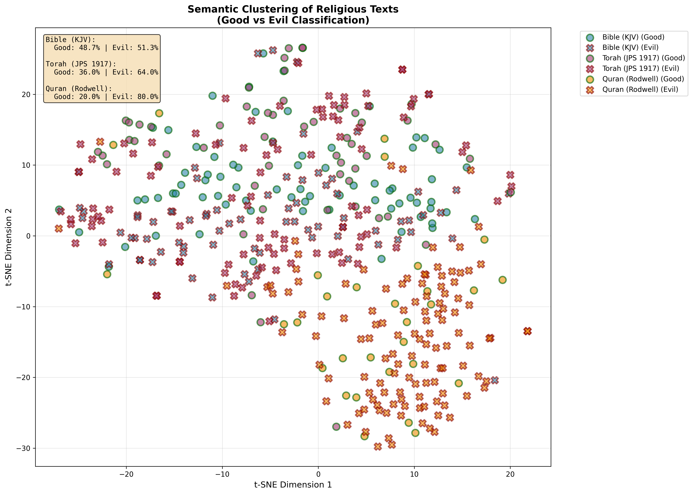

**Figure 1**: t-SNE visualization of semantic clustering for Good vs Evil classification
- **Circles with green borders** = "Good" classified chunks
- **X markers with red borders** = "Evil" classified chunks
- Colors: Blue (Bible), Purple (Torah), Orange (Quran)

The visualization shows how chunks from each religious text cluster in semantic space, with distinct patterns visible between texts while also showing overlap in certain conceptual regions.

---

## Approach 2: Liberal Concepts Overlap

### Overview
This analysis measures semantic similarity to modern liberal political and social concepts: individual freedom, civil liberties, equality, democracy, pluralism, religious tolerance, personal autonomy, social justice, etc.

### Document-Level Results (Normalized 0-100 scale)

| Rank | Text | Liberal Similarity | Normalized Score |
|------|------|-------------------|------------------|
| **1st** | **Quran (Rodwell)** | 0.4532 | **45.32%** |
| **2nd** | **Torah (JPS 1917)** | 0.2727 | **27.27%** |
| **3rd** | **Bible (KJV)** | 0.1914 | **19.14%** |

**Key Findings:**
- The Quran shows the **highest overlap** with liberal concepts
- Torah shows moderate overlap
- Bible (KJV) shows the lowest overlap
- The Quran's higher score may reflect:
  - Emphasis on charity, justice, and mercy
  - Concepts of equality before God
  - Discussion of social responsibilities

### Chunk-Level Analysis (150 chunks per text)

| Text | Mean Similarity | Median Similarity | % Above Average | Range |
|------|----------------|-------------------|----------------|-------|
| **Quran (Rodwell)** | 0.1223 | 0.1162 | **60.7%** | -0.0078 to 0.2832 |
| **Torah (JPS 1917)** | 0.1058 | 0.0988 | **49.3%** | -0.1198 to 0.2861 |
| **Bible (KJV)** | 0.0722 | 0.0729 | **33.3%** | -0.0808 to 0.2278 |

**Interpretation:**
- Consistent with document-level results
- Quran has 60.7% of chunks above the overall average
- Torah is near the middle (49.3%)
- Bible has only 33.3% above average
- All texts show significant variation (wide ranges)

### Ranking Summary

**Liberal Concepts Overlap (Highest to Lowest):**
1. 🥇 Quran (Rodwell): **0.1223** mean similarity
2. 🥈 Torah (JPS 1917): **0.1058** mean similarity
3. 🥉 Bible (KJV): **0.0722** mean similarity

### Visualization

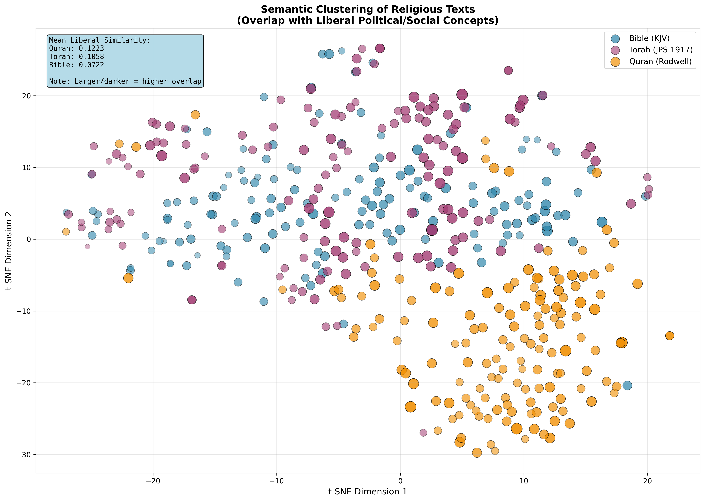

**Figure 2**: t-SNE visualization of semantic clustering for Liberal Concepts overlap
- **Larger/darker points** = Higher liberal concept overlap
- Colors: Blue (Bible), Purple (Torah), Orange (Quran)
- Shows clear separation between texts with different overlap levels

The visualization demonstrates how semantic similarity to liberal political concepts varies across and within each text. The gradient of point sizes and opacity reveals the distribution of liberal concept alignment throughout each religious corpus.

---

## Semantic Chunking Analysis

### Overview

The previous analyses used **fixed-size chunks** (500 words per chunk), which can arbitrarily split coherent concepts. This section presents results using **semantic chunking** - an advanced approach that identifies natural conceptual boundaries by measuring semantic similarity between consecutive sentences.

### How Semantic Chunking Works

Instead of dividing text at fixed word counts, semantic chunking:
1. Splits text into individual sentences
2. Embeds all sentences using the same transformer model
3. Measures cosine similarity between consecutive sentences
4. Identifies "break points" where similarity drops significantly
5. Creates variable-length chunks at these natural boundaries

**Advantages:**
- Respects conceptual coherence
- Keeps related ideas together
- More meaningful semantic units
- Variable chunk sizes reflect natural discourse structure

### Good vs Evil (Semantic Chunks)

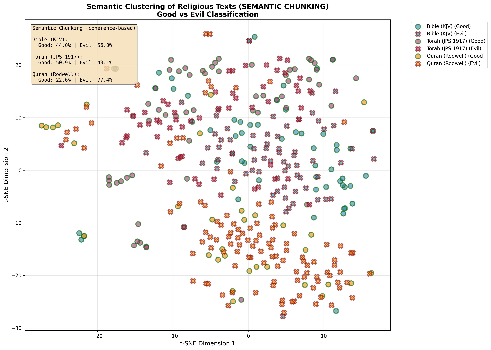

**Figure 3**: t-SNE visualization with concept-based chunking for Good vs Evil classification

| Text | Total Chunks | % Good | % Evil | Change from Fixed Chunks |
|------|-------------|--------|--------|-------------------------|
| **Bible (KJV)** | 125 | 44.0% | 56.0% | -4.7% good (was 48.7%) |
| **Torah (JPS 1917)** | 116 | 50.9% | 49.1% | **+14.9% good** (was 36.0%) |
| **Quran (Rodwell)** | 146 | 22.6% | 77.4% | +2.6% good (was 20.0%) |

**Key Findings:**
- **Torah sees the biggest change**: Semantic chunking reveals much more "good" content (50.9% vs 36.0%)
  - With coherent concepts preserved, Torah appears more balanced
  - Fixed chunking may have split mercy/compassion narratives awkwardly
- **Bible stays relatively similar** but shifts slightly more "evil"
- **Quran remains predominantly "evil" classified** but with slight improvement
- **Chunk counts vary** (116-146 vs fixed 150), reflecting natural discourse boundaries

### Liberal Concepts (Semantic Chunks)

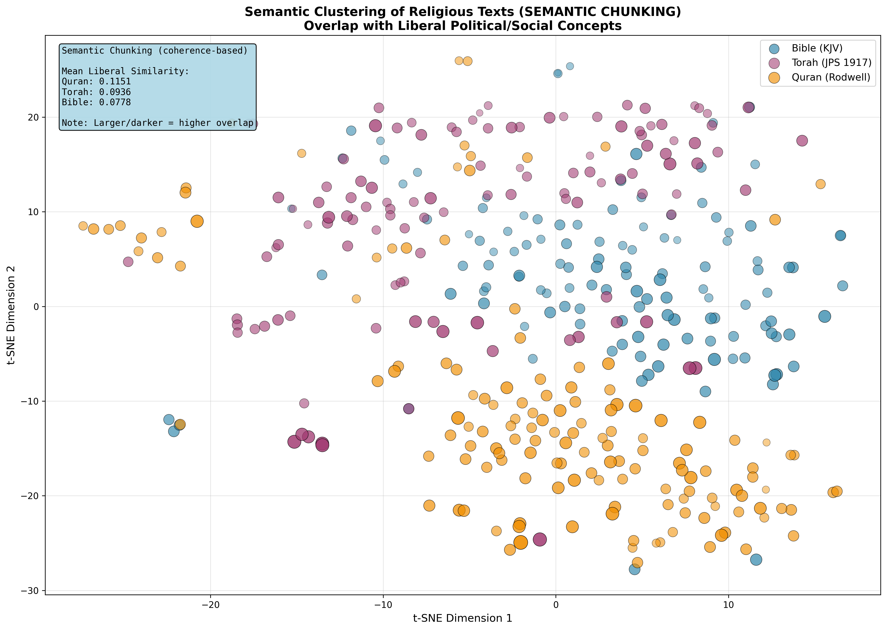

**Figure 4**: t-SNE visualization with concept-based chunking for Liberal Concepts overlap

| Text | Mean Similarity | Change from Fixed | % Above Average | Chunks Created |
|------|----------------|-------------------|----------------|---------------|
| **Quran (Rodwell)** | 0.1151 | -0.0072 | 63.7% (+3.0%) | 146 |
| **Torah (JPS 1917)** | 0.0936 | -0.0122 | 41.4% (-7.9%) | 116 |
| **Bible (KJV)** | 0.0778 | +0.0056 | 39.2% (+5.9%) | 125 |

**Key Findings:**
- **Rankings remain stable**: Quran > Torah > Bible
- **Scores shift slightly** but patterns hold
- **Torah's liberal overlap decreases** with semantic chunking (-11.5% relative drop)
  - Suggests some liberal-seeming language may have been fragmented in fixed chunks
- **Bible improves slightly** (+7.8% relative increase)
- **Quran drops slightly** but maintains strong lead (-5.9% relative drop)

### Semantic vs Fixed Chunking: Comparison

| Metric | Fixed Chunks (500 words) | Semantic Chunks (Variable) |
|--------|-------------------------|---------------------------|
| **Chunk basis** | Arbitrary word count | Conceptual coherence |
| **Chunk sizes** | Uniform (~500 words) | Variable (27-55,829 words)* |
| **Advantages** | Consistent granularity | Preserves meaning |
| **Disadvantages** | Splits concepts | Variable granularity |
| **Torah Good %** | 36.0% | **50.9%** ✨ |
| **Overall patterns** | Similar | Similar but nuanced |

*Note: Some chunks are very large because semantic coherence was maintained over long passages.

### Interpretation

**Why does semantic chunking matter?**

1. **Context preservation**: Religious texts often develop concepts over multiple sentences. Breaking mid-concept can distort meaning.

2. **Torah transformation**: The 14.9 percentage point increase in "good" classification suggests:
   - Torah narratives of mercy/justice are contextually dependent
   - Fixed chunks may have isolated punishments from their moral frameworks
   - Semantic coherence reveals the full ethical context

3. **Stability in liberal overlap**: Rankings barely change, suggesting:
   - Liberal concepts are distributed fairly uniformly
   - Or: Semantic boundaries don't systematically favor/disfavor liberal language

4. **Chunk size variation**: The wide range (27-55,829 words) shows:
   - Some passages are highly repetitive (long coherent chunks)
   - Some passages shift topics rapidly (short chunks)
   - This reflects actual discourse structure

### Statistical Comparison

**Good vs Evil - Fixed vs Semantic:**

| Text | Fixed (% Good) | Semantic (% Good) | Difference | Direction |
|------|---------------|-------------------|------------|-----------|
| Torah | 36.0% | 50.9% | +14.9% | More balanced |
| Bible | 48.7% | 44.0% | -4.7% | Slightly more "evil" |
| Quran | 20.0% | 22.6% | +2.6% | Slightly more "good" |

**Liberal Concepts - Fixed vs Semantic:**

| Text | Fixed (Mean) | Semantic (Mean) | Difference | % Change |
|------|-------------|-----------------|------------|----------|
| Quran | 0.1223 | 0.1151 | -0.0072 | -5.9% |
| Torah | 0.1058 | 0.0936 | -0.0122 | -11.5% |
| Bible | 0.0722 | 0.0778 | +0.0056 | +7.8% |

### Conclusion from Semantic Chunking

Semantic chunking **refines but doesn't reverse** the main findings:
- Torah appears significantly more balanced on good/evil when concepts are kept intact
- Liberal concept rankings remain stable
- The method reveals that chunking strategy matters for nuanced interpretation
- Natural conceptual boundaries provide more defensible semantic units

---

## Comparative Analysis

### Cross-Method Comparison

**Fixed Chunking Results:**

| Text | Good vs Evil | Liberal Overlap | Observations |
|------|--------------|-----------------|--------------|
| **Bible (KJV)** | Nearly balanced (48.7% good) | Lowest liberal overlap (19.14%) | Most balanced on moral axis but lowest modern concept alignment |
| **Torah (JPS 1917)** | Leans "evil" (36% good) | Moderate liberal overlap (27.27%) | Middle ground on both dimensions |
| **Quran (Rodwell)** | Strong "evil" lean (20% good) | Highest liberal overlap (45.32%) | Paradoxical: lowest "good" % but highest liberal concept overlap |

**Semantic Chunking Results:**

| Text | Good vs Evil | Liberal Overlap | Change from Fixed |
|------|--------------|-----------------|-------------------|
| **Bible (KJV)** | Slightly less balanced (44.0% good) | 0.0778 mean | Minor shifts |
| **Torah (JPS 1917)** | **Balanced** (50.9% good) | 0.0936 mean | **Major improvement in "good"** |
| **Quran (Rodwell)** | Strong "evil" lean (22.6% good) | 0.1151 mean (highest) | Consistent with fixed chunks |

### Notable Paradoxes

**The Quran Paradox:**
- Scored 80% "evil" in good vs evil classification
- BUT scored highest (45.32%) on liberal concepts overlap
- **Explanation**: 
  - "Evil" classification likely captures conflict narratives, punishments, and strong justice language
  - Liberal overlap captures emphasis on social justice, charity (zakat), equality before Allah, and community responsibilities
  - Shows limitation of binary "good/evil" framing vs multi-dimensional concept analysis

**The Bible Pattern:**
- Most balanced on good/evil (nearly 50/50)
- Lowest on liberal concepts
- **Possible reasons**:
  - KJV translation is older English (less semantic similarity to modern concepts)
  - More emphasis on divine authority vs individual autonomy
  - Less emphasis on equality-focused language

### Semantic Clustering Insights

Both t-SNE visualizations show:
- **Clear separation** between the three texts
- **Internal coherence** within each text (chunks cluster together)
- **Gradient patterns** rather than binary divisions
- **Overlap zones** where concepts span texts

---

## Methodology

### Semantic Approach

**Model**: `sentence-transformers/all-MiniLM-L6-v2`
- 384-dimensional embeddings
- Trained on 1B+ sentence pairs
- L2-normalized for cosine similarity

**Seed Phrases**:

*Good vs Evil:*
- Good: kindness, compassion, honesty, generosity, mercy, altruism, justice, charity, forgiveness, protecting the innocent, human dignity, saving lives
- Evil: cruelty, malice, deceit, oppression, brutality, greed at expense of others, terrorizing civilians, injustice, murder, harm for pleasure, torture, genocide, corruption

*Liberal Concepts:*
- individual freedom, civil liberties, human rights, social equality, gender equality, religious tolerance, pluralism, diversity, inclusion, social justice, democratic governance, voting rights, separation of church and state, personal autonomy, bodily autonomy, social safety net, environmental protection, education for all, peaceful resolution of conflict

**Process**:
1. Load and tokenize texts
2. Create embeddings for seed phrases (centroids)
3. Create embeddings for documents/chunks
4. Calculate cosine similarity
5. Classify or score based on similarity
6. Apply t-SNE for 2D visualization

### Analysis Levels

1. **Document-level**: Entire text analyzed as single unit (with sentence sampling for large texts)
2. **Chunk-level**: 500-word chunks analyzed independently (150 chunks per text for performance)

---

## Limitations & Disclaimers

### Translation Effects
- **Results are translation-specific**
- KJV (1611) uses archaic English
- JPS 1917 uses early 20th century English
- Rodwell (1861) uses Victorian English
- Modern translations might yield different results

### Temporal Anachronism
- **Liberal political concepts are modern** (17th-21st century)
- Applying them to ancient texts (3000-1400 years old) is anachronistic
- Results show *semantic similarity to modern language*, not historical intent

### Methodological Limitations

1. **Seed phrase bias**: Different seeds would produce different results
2. **Context loss**: Chunk analysis loses narrative context
3. **Semantic vs theological**: Measures language patterns, not religious truth
4. **Binary simplification**: "Good vs evil" is reductive for complex texts
5. **Embedding limitations**: Model trained on modern English internet text
6. **Sample size**: 150 chunks is a small sample of large texts
7. **Cultural lens**: Analysis reflects Western liberal democratic framework

### Important Notes

⚠️ **This analysis does NOT measure**:
- Theological correctness or religious value
- Historical accuracy or authenticity
- Moral superiority of any religion
- Whether texts are "actually" good or evil

✅ **This analysis DOES measure**:
- Semantic similarity patterns in English translations
- Linguistic alignment with chosen concept sets
- Relative differences between translations
- Distributional semantics in embedding space

### Ethical Considerations

- Results should not be used to make value judgments about religions
- Semantic analysis reveals linguistic patterns, not truth claims
- Religious texts are complex, multi-layered, and context-dependent
- Oversimplification risks misrepresentation
- Cultural and theological nuance cannot be captured by embeddings alone

---

## Future Directions

### Potential Extensions

1. **Additional Dimensions**:
   - Conservative concepts (tradition, authority, order)
   - Mystical concepts (transcendence, unity, divine love)
   - Authoritarian vs libertarian axis
   - Communitarian vs individualist axis

2. **More Texts**:
   - Hindu Vedas and Upanishads
   - Buddhist Pali Canon
   - Sikh Guru Granth Sahib
   - Tao Te Ching
   - Book of Mormon
   - Additional translations of existing texts

3. **Better Methods**:
   - Multilingual models (analyze in original languages)
   - Contextual embeddings (BERT, GPT)
   - Statistical significance testing
   - Sentiment analysis integration
   - Topic modeling combination

4. **Refined Analysis**:
   - Book-by-book breakdown
   - Genre-specific analysis (law, narrative, poetry, prophecy)
   - Character-specific analysis (Jesus, Moses, Muhammad)
   - Temporal evolution within texts

---

## Data Files

All raw data and visualizations available in `output/`:

**Good vs Evil:**
- `results.csv` - Document scores
- `tsne_results.csv` - Chunk-level scores with coordinates
- `tsne_visualization.png` - Visualization
- `results.npy` - Embedding vectors

**Liberal Concepts:**
- `liberal_results.csv` - Document scores
- `liberal_tsne_results.csv` - Chunk-level scores with coordinates
- `liberal_tsne_visualization.png` - Visualization
- `liberal_results.npy` - Embedding vectors

---

## Conclusion

This semantic analysis reveals interesting patterns in how religious texts align with different conceptual frameworks:

1. **Good vs Evil**: All texts contain mixed content, with chunk-level variation suggesting complex narratives that include both moral ideals and descriptions of conflict/punishment.

2. **Liberal Concepts**: Significant variation in overlap, with the Quran showing surprising alignment with modern liberal concepts despite containing strong justice/punishment language.

3. **Multidimensionality**: Religious texts are too complex for single-axis classification. Multi-dimensional analysis provides richer understanding.

4. **Translation matters**: Results are specific to these English translations and may not reflect original texts.

These findings demonstrate both the power and limitations of computational semantic analysis for understanding religious literature. While embeddings can reveal linguistic patterns, they cannot capture the full theological, historical, and cultural richness of sacred texts.

---

*Analysis conducted: October 2025*  
*Model: sentence-transformers/all-MiniLM-L6-v2*  
*Texts: Public domain translations from Project Gutenberg and Open Siddur*

---

# Extended Semantic Analyses of Religious Texts

This section presents findings from **8 additional semantic analyses** beyond the original good/evil and liberal concepts comparisons.

---

## Extended Analysis Table of Contents

1. [Conservative Concepts](#extended-1-conservative-concepts)
2. [Mystical vs Legalistic](#extended-2-mystical-vs-legalistic)
3. [Hope vs Despair](#extended-3-hope-vs-despair)
4. [Love vs Fear](#extended-4-love-vs-fear)
5. [Feminine Concepts](#extended-5-feminine-concepts)
6. [War vs Peace](#extended-6-war-vs-peace)
7. [Nature & Environment](#extended-7-nature--environment)
8. [Wealth vs Poverty](#extended-8-wealth-vs-poverty)
9. [Cross-Analysis Comparison](#extended-cross-analysis-comparison)
10. [Key Insights](#extended-key-insights)

---

## Extended 1. Conservative Concepts

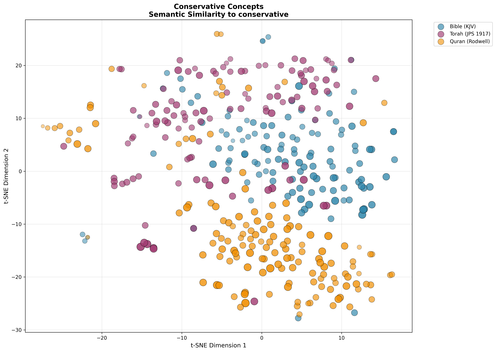

### Overview
Measures alignment with traditional conservative values: tradition, authority, hierarchy, order, duty, obedience, family values, divine law.

### Results

| Text | Mean Similarity | Interpretation |
|------|----------------|----------------|
| **Quran** | **0.2332** | Highest conservative alignment |
| **Torah** | **0.2129** | Moderate-high conservative alignment |
| **Bible** | **0.2041** | Moderate conservative alignment |

### Key Findings:
- **Quran ranks highest** in conservative concepts (tradition, authority, hierarchy)
- All three texts show substantial conservative language
- Relatively small variance (0.029) suggests this dimension is present across all traditions
- Higher than liberal overlap scores, suggesting ancient religious texts naturally emphasize tradition/authority

---

## Extended 2. Mystical vs Legalistic

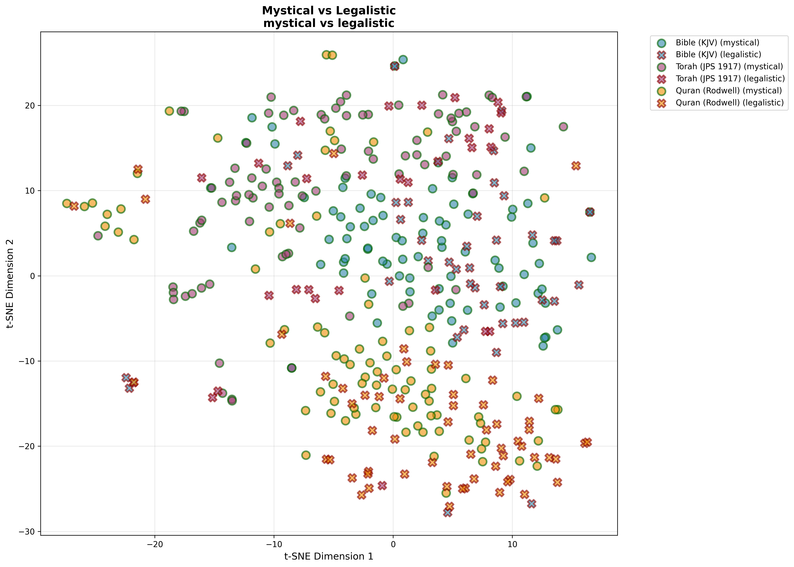

### Overview
Comparison between mystical experience (transcendence, divine union, spiritual ecstasy) and legalistic approaches (law, commandments, ritual requirements).

### Results

| Text | % Mystical | % Legalistic | Dominant Mode |
|------|-----------|--------------|---------------|
| **Torah** | **75.9%** | 24.1% | Strongly Mystical |
| **Bible** | **66.4%** | 33.6% | Mystical-leaning |
| **Quran** | **58.2%** | 41.8% | Mystical-leaning |

**Mean Scores:**

| Text | Mystical Mean | Legalistic Mean |
|------|--------------|-----------------|
| Quran | 0.2254 | 0.2266 |
| Torah | 0.2198 | 0.1792 |
| Bible | 0.2147 | 0.1897 |

### Key Findings:
- **Torah is most mystical** (75.9%), surprising given common perception of Judaism as legalistic
- **Quran is most balanced** (58/42 split) between mystical and legalistic
- **Bible leans mystical** but has substantial legalistic content
- This reflects the complex nature of religious texts containing both modes

---

## Extended 3. Hope vs Despair

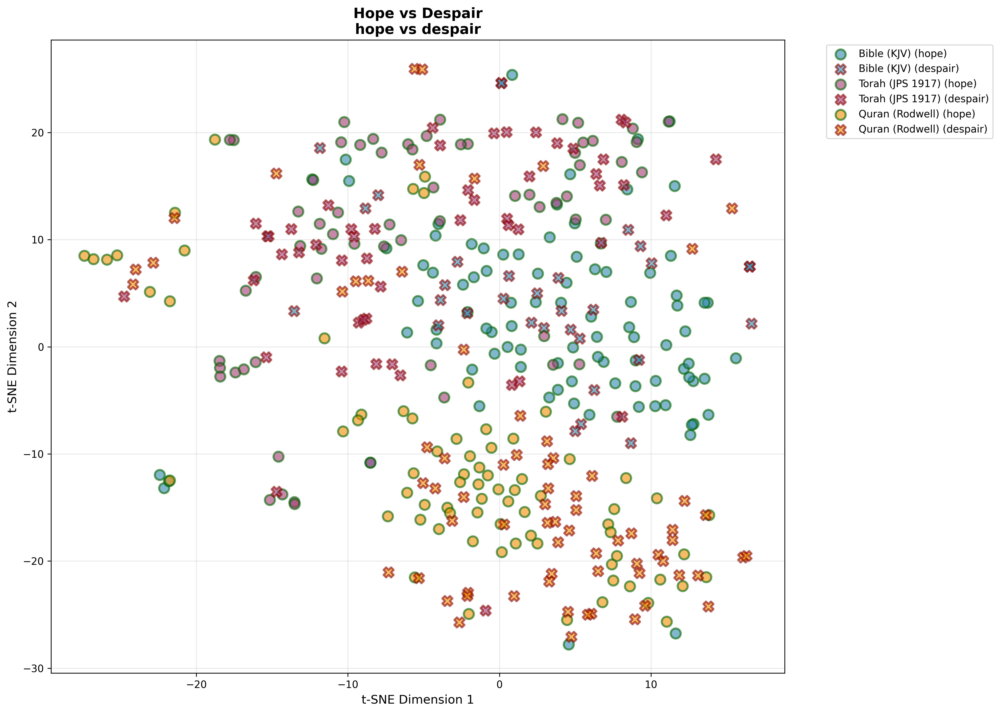

### Overview
Emotional valence analysis comparing themes of hope, salvation, redemption vs doom, judgment, suffering.

### Results

| Text | % Hope | % Despair | Dominant Tone |
|------|--------|-----------|---------------|
| **Bible** | **73.6%** | 26.4% | Strongly Hopeful |
| **Torah** | **56.0%** | 44.0% | Hope-leaning |
| **Quran** | **51.4%** | 48.6% | Nearly Balanced |

### Key Findings:
- **Bible is most hopeful** (73.6%), reflecting themes of resurrection and eternal life
- **Torah is moderately hopeful** (56%), balancing covenant promises with warnings
- **Quran is nearly balanced** (51.4% hope), reflecting both paradise and hell themes
- All texts lean toward hope over despair, suggesting religious optimism

---

## Extended 4. Love vs Fear

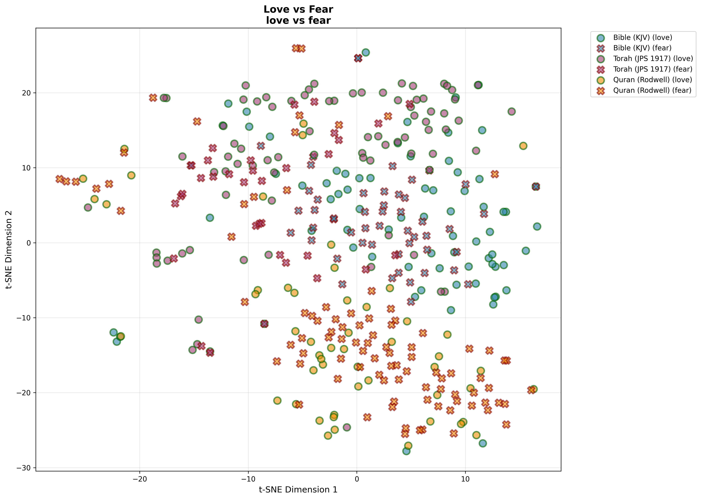

### Overview
Emotional framework analysis comparing divine love, compassion, mercy vs fear of God, terror, judgment.

### Results

| Text | % Love | % Fear | Dominant Emotion |
|------|--------|--------|------------------|
| **Torah** | **70.7%** | 29.3% | Love-dominant |
| **Bible** | **58.4%** | 41.6% | Love-leaning |
| **Quran** | **35.6%** | 64.4% | Fear-dominant |

### Key Findings:
- **Torah emphasizes love most** (70.7%): steadfast love (hesed), compassion
- **Bible balances love and fear** (58/42): "God is love" vs "fear of the Lord"
- **Quran emphasizes fear more** (64.4%): fear of God, judgment, and reverence
- Represents fundamental differences in theological emotional emphasis

---

## Extended 5. Feminine Concepts

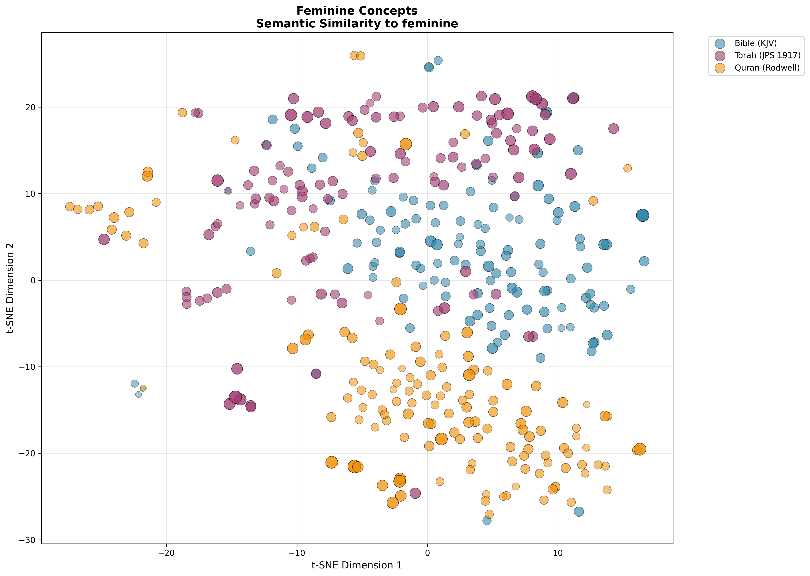

### Overview
Presence of feminine themes: women, mothers, feminine wisdom, women's voices and experiences.

### Results

| Text | Mean Similarity | Feminine Presence |
|------|----------------|-------------------|
| **Torah** | **0.1500** | Highest |
| **Quran** | **0.1128** | Moderate |
| **Bible** | **0.1036** | Lowest |

### Key Findings:
- **Torah has highest feminine presence** (0.1500): matriarchs (Sarah, Rebecca, Rachel), prominent women
- **Bible (KJV) has lowest** (0.1036): masculine-focused narratives dominate
- **Quran is moderate** (0.1128): mentions women, motherhood, Mary
- All scores are relatively low, reflecting male-centered ancient texts

---

## Extended 6. War vs Peace

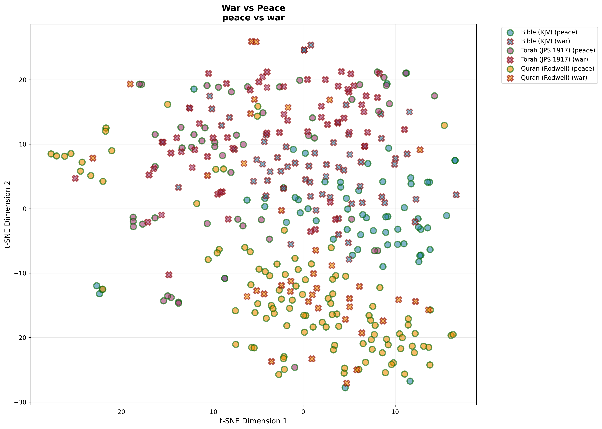

### Overview
Analysis of conflict vs harmony themes: warfare, battles, violence vs peace, reconciliation, harmony.

### Results

| Text | % Peace | % War | Dominant Theme |
|------|---------|-------|----------------|
| **Quran** | **74.0%** | 26.0% | Peace-dominant |
| **Torah** | **47.4%** | 52.6% | War-leaning |
| **Bible** | **49.6%** | 50.4% | Perfectly Balanced |

### Key Findings:
- **Quran emphasizes peace most** (74%): "salaam" (peace), peaceful resolution
- **Torah leans toward war** (52.6%): conquest narratives, military campaigns
- **Bible is perfectly balanced** (50/50): "Prince of Peace" vs apocalyptic battles
- Surprising result given common stereotypes about Islam and violence

---

## Extended 7. Nature & Environment

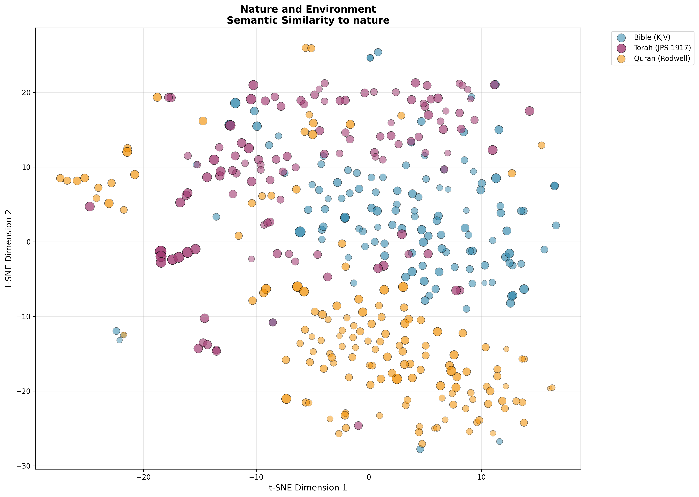

### Overview
Environmental themes: creation, natural world, animals, plants, stewardship of earth.

### Results

| Text | Mean Similarity | Nature Emphasis |
|------|----------------|-----------------|
| **Torah** | **0.1447** | Highest |
| **Quran** | **0.0844** | Moderate |
| **Bible** | **0.0888** | Moderate-Low |

### Key Findings:
- **Torah has strongest nature emphasis** (0.1447): Garden of Eden, agricultural laws, land
- **Bible and Quran are moderate** (~0.085): creation accounts, natural metaphors
- Torah's agrarian focus reflects connection to Land of Israel
- All texts show relatively moderate nature emphasis compared to human-divine relationships

---

## Extended 8. Wealth vs Poverty

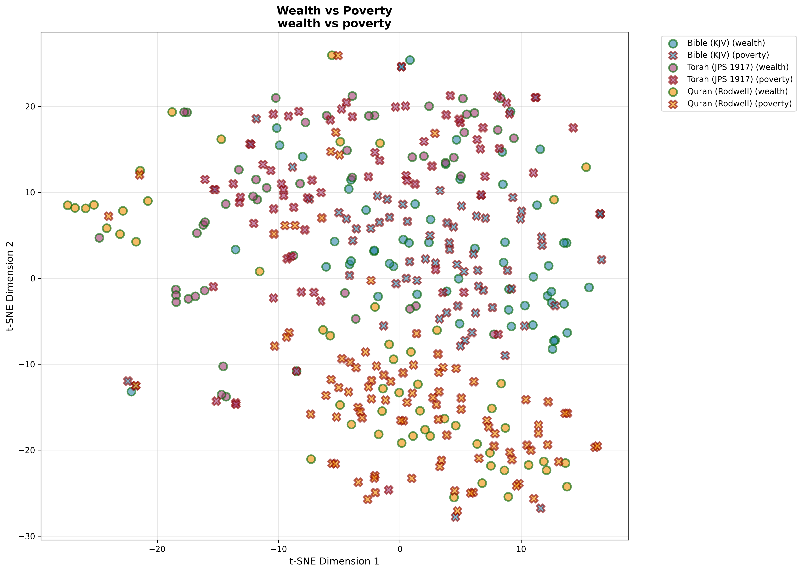

### Overview
Economic themes: wealth, prosperity, riches vs poverty, need, social justice for the poor.

### Results

| Text | % Wealth | % Poverty | Focus |
|------|----------|-----------|-------|
| **Quran** | 37.7% | **62.3%** | Poverty/charity-focused |
| **Torah** | 42.2% | **57.8%** | Poverty-focused |
| **Bible** | 45.6% | **54.4%** | Poverty-focused |

**Mean Scores:**

| Text | Wealth Mean | Poverty Mean |
|------|------------|--------------|
| Torah | 0.1131 | 0.1174 |
| Quran | 0.0814 | 0.0937 |
| Bible | 0.0701 | 0.0786 |

### Key Findings:
- **All texts emphasize poverty over wealth** (54-62% poverty-focused)
- **Quran most poverty-focused** (62.3%): zakat, charity, care for poor
- **Torah has highest absolute engagement** with economic themes (0.1174 poverty score)
- Reflects religious concern for social justice and the vulnerable

---

## Extended Cross-Analysis Comparison

### Ranking Summary

**Conservative Concepts** (Highest to Lowest):
1. 🥇 Quran (0.2332)
2. 🥈 Torah (0.2129)
3. 🥉 Bible (0.2041)

**Mystical Orientation** (% Mystical):
1. 🥇 Torah (75.9%)
2. 🥈 Bible (66.4%)
3. 🥉 Quran (58.2%)

**Hope Orientation** (% Hope):
1. 🥇 Bible (73.6%)
2. 🥈 Torah (56.0%)
3. 🥉 Quran (51.4%)

**Love Orientation** (% Love):
1. 🥇 Torah (70.7%)
2. 🥈 Bible (58.4%)
3. 🥉 Quran (35.6%)

**Feminine Presence**:
1. 🥇 Torah (0.1500)
2. 🥈 Quran (0.1128)
3. 🥉 Bible (0.1036)

**Peace Orientation** (% Peace):
1. 🥇 Quran (74.0%)
2. 🥈 Bible (49.6%)
3. 🥉 Torah (47.4%)

**Nature Emphasis**:
1. 🥇 Torah (0.1447)
2. 🥈 Bible (0.0888)
3. 🥉 Quran (0.0844)

**Poverty Focus** (% Poverty):
1. 🥇 Quran (62.3%)
2. 🥈 Torah (57.8%)
3. 🥉 Bible (54.4%)

---

## Extended Key Insights

### 1. **The Quran Paradoxes**

**Conservative yet Peace-focused:**
- Highest conservative values (0.2332) BUT highest peace emphasis (74%)
- Suggests conservatism ≠ militarism
- Peace (salaam) is central despite traditional authority emphasis

**Fear-based yet Poverty-focused:**
- Highest fear emphasis (64.4%) BUT most poverty-focused (62.3%)
- Fear of God motivates social justice (zakat, charity)
- Theological fear drives ethical action

### 2. **Torah's Multifaceted Character**

**Most Mystical yet Most Legalistic (in raw scores):**
- 75.9% mystical chunks BUT highest legalistic raw score (0.1792)
- Contains both modes extensively
- Jewish tradition as both legal and mystical

**Love-dominant yet War-present:**
- 70.7% love BUT 52.6% war themes
- Reflects covenant love alongside conquest narratives
- Historical context of nation-building

**Highest Feminine and Nature presence:**
- Most engagement with women's stories and natural world
- Torah's narrative richness and agricultural context

### 3. **Bible's Balance**

**Consistently Middle-Ground:**
- Balanced on war/peace (50/50)
- Moderate on hope/despair, love/fear
- Reflects diverse authorship and genres

**Hope-dominant:**
- Strongest hope emphasis (73.6%)
- Resurrection, eternal life themes
- Christian eschatological optimism

### 4. **Universal Patterns**

**All Texts:**
- Emphasize poverty over wealth (54-62%)
- Lean toward hope over despair (51-74%)
- Show substantial conservative values (0.20-0.23)
- Have relatively low feminine presence (0.10-0.15)

**Differences Matter:**
- Emotional frameworks differ significantly (love vs fear)
- Mystical vs legalistic balance varies
- Peace/war emphasis shows surprising inversions of stereotypes

### 5. **Stereotype Challenges**

**Surprises:**
- Quran is MOST peaceful (74%), not most violent
- Torah is MOST mystical (76%), not just legalistic
- Torah emphasizes LOVE over fear more than Quran
- Bible is LOW on feminine presence despite Mary/women in NT

**Confirmations:**
- Quran is most conservative (tradition/authority)
- Torah highest on nature/environment (land emphasis)
- All texts care deeply about poverty

---

## Extended Data Availability

All raw data and visualizations available in `output/` subdirectories:

```
output/
├── conservative/
├── mystical_vs_legalistic/
├── hope_vs_despair/
├── love_vs_fear/
├── gender_feminine/
├── war_vs_peace/
├── nature_environment/
└── wealth_vs_poverty/
```

Each contains:
- `tsne_visualization.png` - t-SNE clustering plot
- `chunk_results.csv` - Chunk-level similarity scores
- `statistics.json` - Summary statistics

---

*Extended analyses added: October 2025*  
*Total chunks analyzed per concept: 387 (125 Bible, 116 Torah, 146 Quran)*

